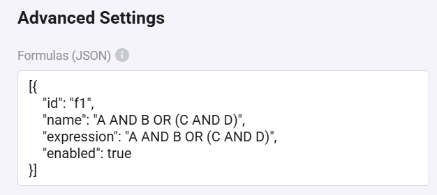

# Boolean Toolbox for Homey


Create advanced, state-aware logic units for your Homey flows. Move beyond simple `AND`/`OR` cards and build powerful logic modules with multiple boolean formulas.

## About the Problem: "Flow Spaghetti"

Standard Homey Flows are powerful, but creating complex logic can quickly become messy. If you have multiple conditions to check, you often end up with a web of logic cards that is hard to read, maintain, and debug.

| Standard Homey Flow | With Boolean Toolbox |
| --- | --- |
|  |  |
| *A complex web of logic cards.* | *A single Logic Unit provides a clean, controllable result.* |

Boolean Toolbox solves this by providing virtual "Logic Unit" devices. Instead of wiring together multiple cards, you define your logic in text-based formulas. Each device can contain multiple formulas, and you can easily switch between them in your flows using dropdown menus.

## Features

- ✅ **Multiple Formulas per Device:** Create a Logic Unit with 2-10 inputs, then define multiple boolean formulas within that device. Switch between formulas using dropdown menus in your flow cards.
- ⚙️ **Dynamic Logic with Expressions:** Define complex logic with simple formulas like `(A+B)*C` or `A XOR (B&C&D)`. Change your logic in seconds without rebuilding flows.
- 🎯 **State-Aware:** The device automatically knows which inputs are needed based on your formula. It waits until it has received status from all required inputs before evaluating.
- 🔄 **Clean & Controllable Outputs:** Each formula provides distinct "Result changed to true" and "Result changed to false" triggers, giving you full control over both outcomes.
- 🎛️ **Flexible Input Options:** Choose the right Logic Unit for your needs - from 2 inputs up to 10 inputs (A-J).
- 🔗 **Deep Flow Integration:** 
  - Set individual inputs with dropdown menus
  - Choose formulas from dropdowns in flow cards
  - Evaluate specific formulas or all formulas at once
  - Check formula results in conditions
- 🧪 **Online Emulator:** Test your logic design before creating a device with the built-in emulator, including a truth table generator.
- 📋 **Multiple Operator Notations:** Use the notation you prefer:
  - AND: `*`, `&`, or `AND`
  - OR: `+`, `|`, or `OR`
  - XOR: `^`, `!=`, or `XOR`
  - NOT: `!` or `NOT`


*Configure multiple formulas in JSON format with comprehensive operator support*

## Installation

This app is available in the official Homey App Store, or you can install it manually.

### Method 1: From Homey App Store (Recommended)

1. Open the Homey app on your phone
2. Go to **Apps** and search for **"Boolean Toolbox"**
3. Click **Install**

### Method 2: Install from URL

1. Go to **Settings** > **Apps** in your Homey app
2. Click the **(+) Add app** button
3. Click on **Custom URL**
4. Enter the URL to this repository's latest release
5. Follow the on-screen instructions to install

### Method 3: For Developers

If you have the Homey CLI installed, you can clone this repository and run the app locally:

```bash
git clone https://github.com/Tiwas/HomeyBooleanToolbox.git
cd HomeyBooleanToolbox/no.tiwas.booleantoolbox
npm install
homey app run
```

## How to Use

### 1. Add a Logic Unit Device

Add a new device in Homey and find **Boolean Toolbox**. Choose the Logic Unit type based on how many inputs you need:
- Logic Unit (2 inputs) - Uses inputs A, B
- Logic Unit (3 inputs) - Uses inputs A, B, C
- ...up to...
- Logic Unit (10 inputs) - Uses inputs A-J

### 2. Configure Formulas

Go to the device's **Advanced Settings** to configure formulas in JSON format:

```json
[
  {
    "id": "f1",
    "name": "Outdoor Light Logic",
    "expression": "A AND (B OR C)",
    "enabled": true
  },
  {
    "id": "f2",
    "name": "Night Mode",
    "expression": "!D",
    "enabled": true
  }
]
```

**Formula Properties:**
- `id`: Unique identifier (required)
- `name`: Display name shown in dropdown menus (required)
- `expression`: Boolean expression using available inputs (required)
- `enabled`: Set to `false` to disable a formula (optional, default: `true`)

**Supported Operators:**
- **AND:** `A AND B`, `A * B`, `A & B`
- **OR:** `A OR B`, `A + B`, `A | B`
- **XOR:** `A XOR B`, `A ^ B`, `A != B`
- **NOT:** `NOT A`, `!A`
- **Grouping:** Use parentheses `()` to control evaluation order

**Example Expressions:**
- Simple: `A AND B`
- Grouped: `(A+B)*C`
- Complex: `A XOR (B&C&D)`
- Nested: `!(A|B) & (C!=D)`

### 3. Use in Flows

**When... (Triggers):**
- **"Formula result changed to TRUE"** - Triggered when a specific formula evaluates to true
- **"Formula result changed to FALSE"** - Triggered when a specific formula evaluates to false

**Then... (Actions):**
- **"Set input value"** - Set any input (A-J) to true or false, then evaluate all formulas
- **"Set input and evaluate formula"** - Set an input and evaluate only a specific formula
- **"Evaluate formula"** - Re-evaluate a specific formula with current inputs
- **"Evaluate all formulas"** - Re-evaluate all enabled formulas

**And... (Conditions):**
- **"Formula result is..."** - Check if a formula's current result is true or false

**Tips:**
- All flow cards use dropdown menus for easy selection of devices, inputs, and formulas
- You can select formulas across all Logic Units in triggers (shows as "Formula Name (Device Name)")
- Inputs are only active if they're used in the formula expression

## Logic Emulator

Test your logic expressions before implementing them in Homey with our interactive online emulator.

**[Try the Emulator Here](https://tiwas.github.io/HomeyBooleanToolbox/emulator.html)**

**Emulator Features:**
- Support for all 10 inputs (A-J)
- Only active inputs are enabled based on your expression
- Three-state switches (undefined/true/false)
- Real-time result evaluation
- **Truth Table Generator:** Expand the truth table panel to see all possible input combinations and their results (supports up to 6 inputs for readability)
- Support for all operator notations
- Invert final result option

## Examples

### Example 1: Outdoor Light Control
**Scenario:** Turn on outdoor light when it's dark AND (motion detected OR door opened)

```json
[{
  "id": "outdoor",
  "name": "Outdoor Light",
  "expression": "A AND (B OR C)",
  "enabled": true
}]
```

**Flow:**
- **When** motion sensor detects motion → **Then** Set input B to true
- **When** door sensor opens → **Then** Set input C to true
- **When** lux sensor < 100 → **Then** Set input A to true
- **When** formula "Outdoor Light" changed to TRUE → **Then** Turn on outdoor light

### Example 2: Multiple Scenarios
**Scenario:** One device handling multiple lighting scenarios

```json
[
  {
    "id": "evening",
    "name": "Evening Mode",
    "expression": "(A OR B) AND NOT C",
    "enabled": true
  },
  {
    "id": "night",
    "name": "Night Mode",
    "expression": "A AND C AND D",
    "enabled": true
  },
  {
    "id": "away",
    "name": "Away Mode",
    "expression": "D XOR E",
    "enabled": true
  }
]
```

## Community & Support

- **Discussion Thread:** [Homey Community Forum](https://community.homey.app/t/app-boolean-toolbox-create-advanced-logic-with-simple-formulas/143906)
- **Issues & Bug Reports:** [GitHub Issues](https://github.com/Tiwas/HomeyBooleanToolbox/issues)
- **Source Code:** [GitHub Repository](https://github.com/Tiwas/HomeyBooleanToolbox)

## Project Structure

```
.
├── no.tiwas.booleantoolbox/     # Main application source code
│   ├── app.json                 # App configuration
│   ├── app.js                   # Main app logic
│   ├── drivers/                 # Device drivers (2-10 inputs)
│   │   ├── logic-unit-2/
│   │   ├── logic-unit-3/
│   │   └── ...
│   ├── assets/                  # App icons and images
│   └── locales/                 # Translations
├── web/                         # Web assets
│   ├── emulator.html           # Online logic emulator
│   ├── homey std.png           # Documentation images
│   ├── logic unit.jpg
│   └── advanced_settings.png
└── README.md                    # This file
```

## For Developers

This project is built with the Homey SDK v3.

**Development Setup:**
```bash
git clone https://github.com/Tiwas/HomeyBooleanToolbox.git
cd HomeyBooleanToolbox/no.tiwas.booleantoolbox
npm install
homey app run
```

**Key Files:**
- `app.js` - Flow card registration and helper functions
- `drivers/logic-unit-X/device.js` - Device logic and formula evaluation
- `drivers/logic-unit-X/driver.js` - Device pairing and initialization
- `app.json` - App manifest with all flow cards and driver configurations

## Changelog

### Version 1.0.0
- Complete rewrite with multi-formula support
- Added Logic Unit types for 2-10 inputs
- Dropdown menus for easy formula selection
- Support for multiple operator notations
- Enhanced emulator with truth table generator
- Improved input state management

### Version 0.7.0
- Initial public release
- Basic single-formula logic units
- 5 inputs (A-E) support

## Contributing

Contributions are welcome! Please feel free to submit a Pull Request.

## Author

**Lars Kvanum**
- GitHub: [@Tiwas](https://github.com/Tiwas)
- Homey Community: [Profile](https://community.homey.app/u/tiwas)

## Support the Project

If you find this app useful, consider supporting its development:

[](https://paypal.me/tiwasno)

## License

This project is licensed under the MIT License - see the [LICENSE](LICENSE) file for details.

---

**Boolean Toolbox** - Simplify complex logic in your Homey flows ⚡