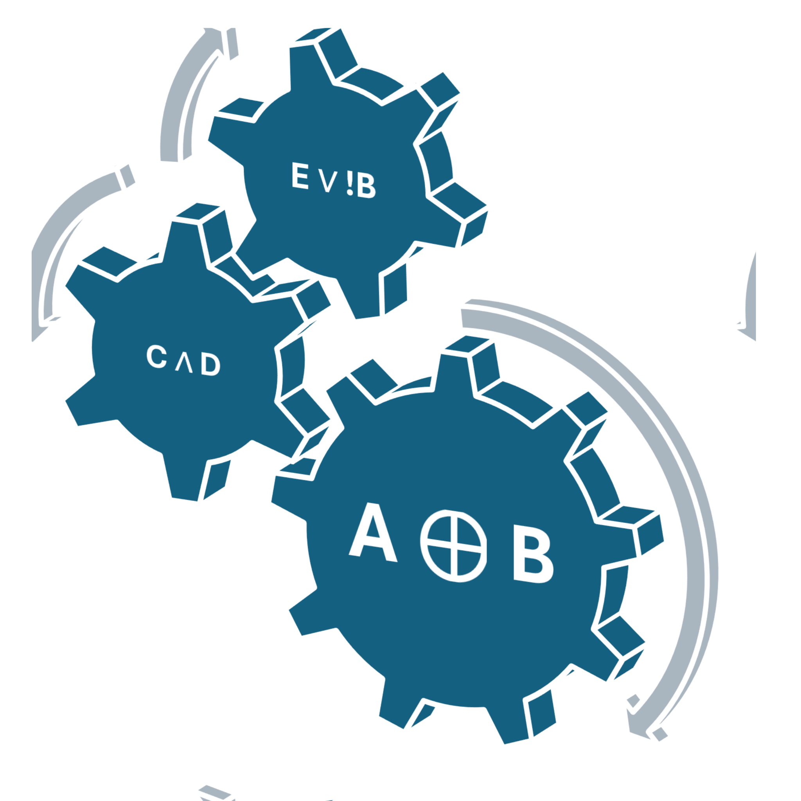

# Boolean Toolbox for Homey



Create advanced, state-aware logic units for your Homey flows. Move beyond simple `AND`/`OR` cards and build complex, reusable logic modules that can remember state and wait for multiple conditions to be met.

## About

Standard Homey Flows are powerful, but creating complex logic (e.g., "turn on lights only if it's dark, motion is detected, *and* the alarm is not set") can become messy and hard to maintain.

Boolean Toolbox solves this by providing virtual "Logic Unit" devices. Each device can be configured with up to five inputs (A, B, C, D, E), each with its own logical operator (AND, OR, XOR) and inversion (NOT). The device evaluates the state of all enabled inputs and produces a single `true` or `false` output, which can then be used to trigger other flows.

## Features

- ✅ **State-Aware Logic:** The device waits for all enabled inputs to receive a signal before evaluating, ensuring all conditions are met.
- ⚙️ **Highly Configurable:** Enable or disable inputs, choose an operator for each, and invert signals as needed.
- 🔄 **Auto-Reset:** Inputs can be configured to automatically reset after evaluation, perfect for simple trigger-and-forget scenarios.
- 🔗 **Deep Flow Integration:** Uses dedicated Flow cards for setting inputs and reacting to the output, making your flows cleaner and easier to read.
- 🧪 **Online Emulator:** Test your logic design before creating a device with the built-in emulator.

## Installation

This app is not currently in the official Homey App Store. You can install it manually.

### Method 1: Install from URL (Recommended)

1.  Go to **Settings** > **Apps** in your Homey app.
2.  Click the **(+) Add app** button.
3.  Click on **Custom URL**.
4.  Enter the URL to the `app.json` file from this repository's latest release. For example:
    `https://raw.githubusercontent.com/YOUR_USERNAME/Boolean-Toolbox/main/no.tiwas.booleantoolbox/app.json`
5.  Follow the on-screen instructions to install.

### Method 2: For Developers

If you have the Homey CLI installed, you can clone this repository and run the app locally.

```bash
git clone https://github.com/YOUR_USERNAME/Boolean-Toolbox.git
cd Boolean-Toolbox/no.tiwas.booleantoolbox
npm install
homey app run --remote

## How to Use

1.  **Add a Device:** Add a new device in Homey and find **Boolean Toolbox** under the "Community" section. Create a new "Logic Unit".
2.  **Configure the Unit:** Go to the device's settings. For each input (A-E), you can:
    - **Enable Input:** Turn the input on or off.
    - **Operator:** Choose how this input's value is combined with others (`AND`, `OR`, `XOR`).
    - **Invert (NOT):** Invert the signal from `true` to `false`, or vice versa.
    - **Auto-reset:** If checked, the input will automatically reset after the logic is evaluated.
3.  **Use in Flows:**
    - Use the **"Set input [A-E] to true/false"** Action cards to provide signals to your Logic Unit.
    - Use the **"Output becomes true/false"** Trigger cards to start a new flow when the final result changes.
    - Use the **"Output is true"** Condition card to check the current state in your existing flows.

## Logic Emulator

Don't want to create a device just to test an idea? You can use the online emulator to design and test your logic before implementing it in Homey.

**[Try the Emulator Here](emulator.html)**

## Project Structure

The source code for the Homey application itself is located within the `no.tiwas.booleantoolbox` directory.

.
├── no.tiwas.booleantoolbox/ <-- Main application source code
│ ├── app.json
│ ├── drivers/
│ ├── assets/
│ └── ...
├── emulator.html <-- The online logic emulator
└── README.md


## For Developers

This project is built with the Homey SDK v3. To get started with development:

1.  Clone the repository.
2.  Navigate into the app directory: `cd no.tiwas.booleantoolbox`
3.  Install dependencies: `npm install`
4.  Run the app in development mode: `homey app run --remote`

## Author

- **Lars Kvanum**

## License

This project is licensed under the MIT License - see the [LICENSE](LICENSE) file for details.
```